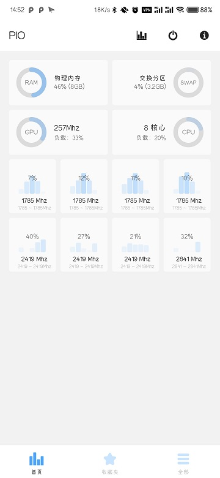
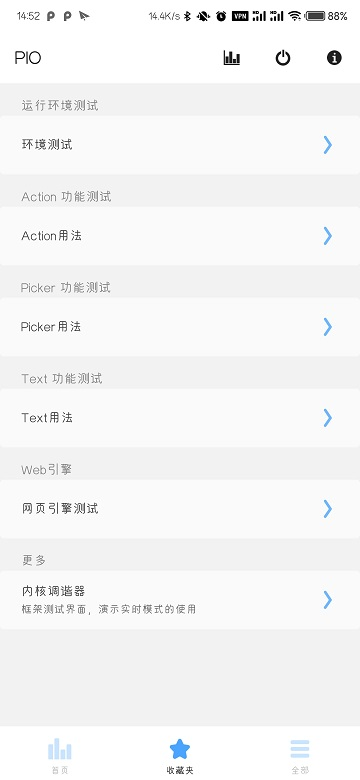
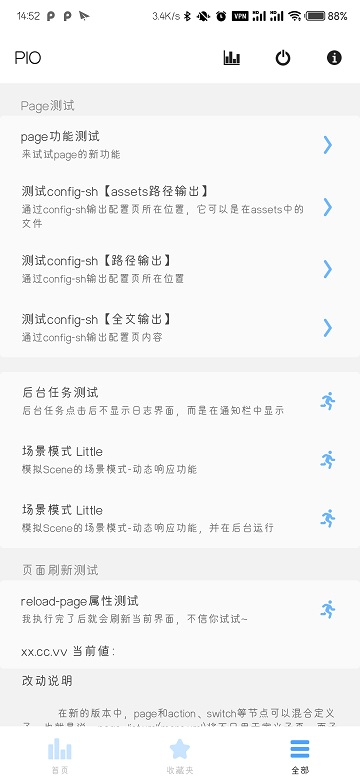
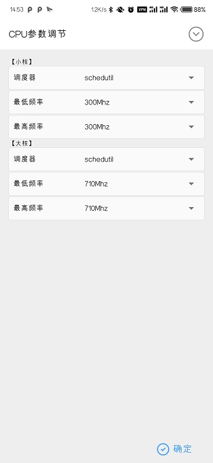

# 注意：3.9.2 之后版本的开发文档，改为随示例APK发布
# 在线的文档将不再同步更新
# 以下内容仅适于3.9.1及以前的版本

## 简介

### 功能用途
- 利用本框架，通过 `xml + shell` 快速创建具有ROOT权限的玩机工具
- 如果你对`linux shell`脚本语法有一定了解，上手将会非常迅速
- 大多数情况下，只需要修改应用`assets`中的静态文件，即可完成功定义和修改
- 而不需要修改和编译`Java、Kotlin`代码

### 文档目录

1. 功能节点：功能组成
    - [page](./docs/Page.md) 设置功能页面
    - [action](./docs/Action.md) 设置动作节点
    - [switch](./docs/Switch.md) 设置开关节点
    - [picker](./docs/Picker.md) 设置单选列表节点

2. 外观节点：让界面更美观
    - [text](./docs/Text.md) 显示格式化的文本
    - [group](./docs/Group.md) 对功能进行分组

3. 重要建议：帮助梳理代码
    - [脚本使用](./docs/Script.md) 将脚本作为独立文件
    - [resource](./docs/Resource.md) 使用添加到`assets`中的文件
    - [visible属性](./docs/Property_Visible.md) 功能的显示和隐藏

4. 额外拓展（附加内容）
    - [其它](./docs/Extra.md) 了解框架对Shell所做的额外补充

5. HTML网页（附加内容）
    - [KrScriptCore](./docs/js-engine/WebBrowser.md "网页上运行脚本 说明章节")

6. 其它说明
    - [其它提示](./docs/Other.md)
    - [kr-script.conf](./docs/kr-script.conf.md) 深入了解启动过程

### 界面展示
- 在开始之前，不妨先看看界面。
- 也可以下载最新的release安装包
- 在你已经ROOT的手机或模拟器上查看效果
- [已发布的 Release版本](https://github.com/helloklf/kr-scripts/releases)

   